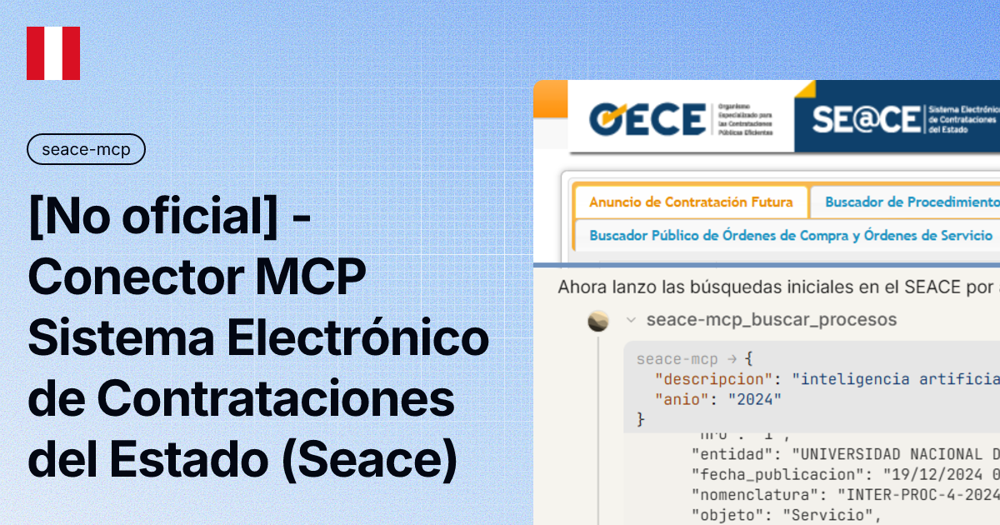

# seace-mcp




Servidor MCP **local** para buscar y leer el **SEACE** — Sistema Electrónico
de la Contratación del Estado (SEACE 3.0): procesos de selección, fichas de
selección, documentos, contratos publicados y Plan Anual de Contrataciones
— desde tu harness MCP. Sin navegador ni credenciales.

> Herramienta **no oficial**: sin afiliación con el OECE ni el Estado peruano.

| Aspecto | Detalle |
|---|---|
| Fuentes | [Buscador Público SEACE 3.0](https://prod2.seace.gob.pe/seacebus-uiwd-pub/buscadorPublico/buscadorPublico.xhtml) (procesos, fichas y documentos), API de contratos y PAC del mismo portal |
| Autenticación | Ninguna: todo el flujo es público |
| Almacenamiento | **Ninguno** — nunca guarda archivos: devuelve datos limpios y URLs de descarga |
| Transporte | stdio (Claude Desktop, Claude Code, agentes MCP) |

## Cómo funciona

1. **Buscador público** — consulta los 6 buscadores (procesos,
   ACF, expresiones de interés, difusión de requerimientos, OCOS y CCO),
   pagina a demanda y navega a la ficha de selección con todo su detalle
   (items, cronograma, participantes, documentos).
2. **API de contratos** — búsqueda, detalle completo,
   contratos por expediente, resumen georreferenciado y catálogos.
3. **PAC** — Plan Anual de Contrataciones por entidad y año, con el
   detalle de los procesos programados.
4. **Documentos** — URLs de descarga directa de PDF (nunca los baja ni
   los guarda).

## Instalación

### Opción A — Claude Desktop (un JSON)

1. Instala [uv](https://docs.astral.sh/uv/).
2. Añade a la configuración de servidores MCP:

```json
{
  "mcpServers": {
    "seace": {
      "command": "uv",
      "args": ["--directory", "RUTA/seace-mcp-oss", "run", "seace-mcp", "serve"]
    }
  }
}
```

### Opción B — Bundle (.mcpb)

1. Descarga **`seace-mcp-0.2.1.mcpb`** desde
   [https://github.com/pipaacebedo/seace-mcp/releases](https://github.com/pipaacebedo/seace-mcp/releases).
2. Instálalo según tu cliente:
   - **Claude Desktop**: **Ajustes → Extensiones → Instalar desde archivo**
     y elige el bundle.
   - **Codex**: extrae el bundle (es un archivo zip) y añade en
     `~/.codex/config.toml`:

     ```toml
     [mcp_servers.seace]
     command = "uv"
     args = ["run", "--directory", "RUTA_EXTRAIDA", "server.py"]
     ```

   - **Antigravity**: extrae el bundle (es un archivo zip) y añade un
     servidor MCP local con `command: uv` y
     `args: ["run", "--directory", "RUTA_EXTRAIDA", "server.py"]`.
     Requiere tener [uv](https://docs.astral.sh/uv/) instalado.

## Tools (25)

| Tool | Qué hace |
|---|---|
| `buscar_procesos` | Procesos de selección de cualquier anio (filtros: descripcion, entidad, tipo, objeto, modalidad, SNIP, CUI) |
| `buscar_acf` | Anuncios de contratación futura |
| `buscar_expresiones_interes` | Expresiones de interés |
| `buscar_requerimientos` | Difusión de requerimientos |
| `buscar_ocos` | Órdenes de compra/servicio (anio + mes + RUC) |
| `buscar_cco` | Condiciones de contratación (contratos estandarizados) |
| `buscar_entidades` | Entidades por nombre/RUC/sigla |
| `ficha_proceso` | Ficha de selección: cabecera, items con CUBSO/MYPE/participantes, cronograma, documentos |
| `detalle_item` | Acciones por item del proceso (ciclo de vida) |
| `historial_proceso` | Historial de contrataciones por convocatoria |
| `codigos_proceso` | SNIP/CUI publicados del proceso |
| `buscar_pac` | Plan Anual de Contrataciones por entidad y anio |
| `detalle_pac` | Procesos programados del PAC (mes y fuente) |
| `buscar_contratos` | Contratos publicados (filtros acotadores server-side) |
| `detalle_contrato` | Ficha completa del contrato: items CUBSO, garantías, acciones, disputas, arbitrajes, documentos |
| `contratos_expediente` | Todos los contratos publicados de un expediente |
| `fichas_procesos` | Lote de fichas o resúmenes de procesos en una llamada (cap 8 completa / 50 resumen) |
| `detalles_contratos` | Lote de detalles de contratos en una llamada (cap 10) |
| `resumen_georef` | Resumen por departamento/anio y drill-down por objeto |
| `catalogo_ubigeo` | Departamentos, provincias y distritos |
| `tipos_seleccion_contratos` | Catálogo de tipos de selección de la API |
| `url_documento` | URL de descarga del PDF de un documento de proceso |
| `url_documento_contrato` | URL de descarga del documento de un contrato |
| `url_perfil_proveedor` | Perfil del proveedor en el portal OECE |
| `listar_filtros` | Valores exactos de los combos y catálogos |

## Cómo se usa (capas)

1. **Buscar** — `buscar_*`: cada resultado lleva `index` global (continuo
   entre páginas), `total` y `paginas`. La página siguiente es una
   re-llamada con `(ses, pagina)` sin cambiar los filtros.
2. **Detalle** — `ficha_proceso(ses, index)`: cabecera, items,
   cronograma y documentos del proceso.
3. **Profundidad** — `detalle_item(ses, index, nro_item)`,
   `historial_proceso(ses, index)` y `codigos_proceso(ses, index)`.
4. **Contratos** — `buscar_contratos` → `detalle_contrato(id_contrato)`;
   `contratos_expediente(id_expediente)`; agregados con `resumen_georef`
   y `catalogo_ubigeo`.
5. **Documentos** — `url_documento(uuid)`, `url_documento_contrato(id)`
   y `url_perfil_proveedor(ruc)`: devuelven URL, no archivos.
6. **PAC** — `buscar_pac(entidad, anio)` y `detalle_pac(entidad, anio)`.

**Higiene de contexto:** el servidor nunca recorta ni oculta información:
cada respuesta contiene completo lo que el portal publica (el tamaño de
página es 15, el del sitio; los agregados se acotan con `nota`
explicando lo mostrado). Cuando necesites varios procesos o contratos a
la vez, usa los lotes (`fichas_procesos`, `detalles_contratos`): una
llamada con cap en vez de repetir la misma llamada.

## Notas de uso

- Las sesiones (`ses`) viven 15 minutos desde su última actividad (cada
  uso renueva el contador) y sirven para paginar y encadenar la
  profundidad; al vencer, el error lo indica con su pista.
- La URL de descarga del PDF se firma al vuelo y tiene vigencia corta:
  descarga rápido tras obtenerla.
- Ante entidades sin PAC publicado, la respuesta lo explica — no cuelga.
- Un proceso de emergencia puede tener items vacíos (no es error).

## Aviso legal

- Proyecto independiente, **no oficial**, sin relación con el OECE ni
  ninguna entidad del Estado peruano.
- Sin garantía de disponibilidad del servicio upstream ni de exactitud
  de los textos; para uso serio, verifica siempre en la fuente oficial.
- La información y datos provienen del portal del OECE.

## Licencia

[Apache-2.0](LICENSE)
